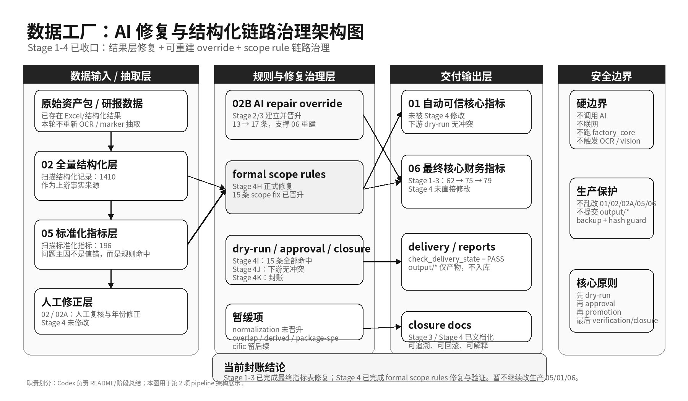

# _datefac

AI 自动数据分析与报告生成系统（数据工厂修复治理模块）

## 项目简介
`_datefac` 是一个面向券商研报与结构化财务数据的数据工厂项目。  
系统支持从结构化输入中完成解析、标准化、指标提取、修复治理与可交付结果校验。

当前已完成的核心治理工作聚焦在：
- 财务指标数据修复
- override-first 可重建链路
- structured-layer scope rule 治理

## 核心能力
- Excel/结构化财务指标解析与分层存储
- AI extract-positive 候选接入（受控门禁）
- allowlist gate / merge simulation / dry-run apply
- override-first 可重建修复链路
- backup/hash guard 与回滚保障
- diff / applied / skipped 报告
- final metric override 层治理
- structured-layer mapping / scope rule 治理
- delivery state check（交付状态自动校验）

## 数据链路概览
- `02_研报全量结构化数据.xlsx`：结构化事实层
- `05_核心财务指标标准化.xlsx`：标准化指标层
- `01_自动可信核心指标.xlsx`：自动可信指标层
- `02_人工复核指标队列.xlsx` / `02A_人工年份修正覆盖表.xlsx`：人工复核与年份修正层
- `data/overrides/02B_ai_repair_override.xlsx`：AI repair override 层
- `06_最终核心财务指标.xlsx`：最终核心财务指标交付表
- `data/mapping/formal_scope_rules.json`：正式 scope 规则层

## 当前阶段成果（Stage 1 ~ Stage 4）
- Stage 1（AI extract-positive safe repair）：
  - 生产 `06` 行数 `62 -> 75`
  - 仅应用 safe candidates，保留 backup/hash guard，交付 `PASS`
- Stage 2（rebuildability/provenance）：
  - 建立 `data/overrides/02B_ai_repair_override.xlsx`
  - 证明 `06` 可通过 override-first flow 重建
- Stage 3（override-first backlog repair）：
  - official `02B`：`13 -> 17`
  - 生产 `06`：`75 -> 79`
  - 新增 4 条 `FINAL_METRIC_OVERRIDE_ONLY`
  - 原 75 行保留、无重复、无冲突、交付 `PASS`
- Stage 4（structured-layer scope rule repair）：
  - 15 条 scope fix 晋升正式规则
  - 15 条正式 scope rule 验证命中
  - downstream dry-run：`05/01/06/02B` 冲突均为 `0`

## 安全边界
- 不直接污染生产 Excel
- 重要变更先 dry-run
- 通过 approval package 做晋升
- 通过 post verification + closure 收口
- `output/*` 作为临时产物，不纳入正式提交

## 为什么不直接手改 Excel
- 手改不可追溯
- 重跑易覆盖丢失
- 审计困难
- 难以系统判断冲突与重复
- override-first 与 scope rule 治理可保证可维护、可重建

## 当前未覆盖与后续方向
- normalization fix 暂未晋升
- overlap review 暂未处理
- derived metric rule 暂未处理
- package-specific rule 暂未处理
- Stage 4 未直接更新生产 `05/01/06`
- 后续可进入 Stage 5：derived metric / package-specific / report generation integration

## 延伸文档
- Stage 1~4 总结：[docs/project_stage1_to_stage4_summary.md](docs/project_stage1_to_stage4_summary.md)
- Stage 3 closure：[docs/stage3_override_first_repair_closure.md](docs/stage3_override_first_repair_closure.md)
- Stage 4 closure：[docs/stage4_structured_layer_scope_rule_repair_closure.md](docs/stage4_structured_layer_scope_rule_repair_closure.md)
