# DateFac Human-Reviewed Client Preview Demo Runbook 341B (English)

## 1. One-Line Positioning

This runbook explains how DateFac should be demonstrated at the `341A` milestone: a real-PDF to human-reviewed client-preview chain, not a formal client-delivery or production-pipeline story.

## 2. Current Status

- `demo_ready = true`
- `client_preview_ready = true`
- `client_ready = false`
- `production_ready = false`
- `not investment advice`

## 3. Who This Runbook Is For

- people who need the fastest accurate explanation of the current DateFac state
- people preparing GitHub, interview, or demo narration
- people who want to understand what 340B-341A added beyond AI dry-run evaluation

## 4. What The Current Demo Can Show

- how real research PDFs enter the MinerU-first intake flow
- how deterministic rules perform candidate precision, context repair, reviewed strictness, and year-alignment QA
- how AI review exists only as a dry-run judgment layer
- how human review is inserted before client preview
- how full validation, apply planning, and post-human sidecar handling preserve no-write-back boundaries
- how 34 human-reviewed core metrics become the preview set
- how the audit verifies zero duplicate, unit, source-trace, and unsafe-claim issues

## 5. What The Current Demo Must Not Promise

- official client delivery
- production readiness
- automatic write-back
- no-human-review automation
- investment advice
- scalable production stability

## 6. Real Workflow Diagram

```mermaid
flowchart LR
    A["Real PDFs"] --> B["337A MinerU-first intake"]
    B --> C["337B precision calibration"]
    C --> D["337C context repair"]
    D --> E["337D reviewed strictness and year alignment QA"]
    E --> F["338A-338D AI dry-run review and adoption simulation"]
    F --> G["340B workbook-based human review package"]
    G --> H["340C full validation"]
    H --> I["340D final apply plan"]
    I --> J["340E post-human sidecar result"]
    J --> K["340F human-reviewed client preview"]
    K --> L["340G client preview audit"]
    L --> M["341A milestone package"]
```

## 7. Headline Metrics

- `340B review queue = 77`
- `340C filled = 77 / pending = 0`
- `340D reviewed_after_human_candidate_count = 34`
- `340E reviewed_after_human_total_count = 34`
- `340F client_preview_core_metric_count = 34`
- `340G audited_core_metric_count = 34`
- `duplicate_issue_count = 0`
- `unit_issue_count = 0`
- `missing_source_trace_count = 0`
- `unsafe_claim_count = 0`
- `qa_fail_count = 0`

## 8. Main Excel Artifacts

- `D:\_datefac\output\human_review_after_ai_adoption_340b\human_review_after_ai_adoption_340b_review_template.xlsx`
- `D:\_datefac\output\human_review_apply_simulation_340c\human_review_apply_simulation_340c_apply_plan.xlsx`
- `D:\_datefac\output\full_human_review_apply_plan_340d\full_human_review_apply_plan_340d.xlsx`
- `D:\_datefac\output\post_human_review_sidecar_result_340e\post_human_review_sidecar_result_340e.xlsx`
- `D:\_datefac\output\client_preview_after_human_review_340f\client_preview_after_human_review_340f.xlsx`
- `D:\_datefac\output\client_preview_export_audit_340g\client_preview_export_audit_340g.xlsx`
- `D:\_datefac\output\human_reviewed_client_preview_milestone_341a\human_reviewed_client_preview_milestone_341a.xlsx`

## 9. Human Review Loop

The point of the human-review loop is not merely that “there is an Excel workbook.” It is that rows still unsafe for automatic adoption after AI dry-run remain isolated for manual judgment, then pass through full validation and apply planning before any preview promotion.

The key boundaries are:

- AI decisions are dry-run only
- human review happens before client preview
- 340C / 340D / 340E / 340F / 340G remain no-write-back
- rejected and needs-review rows do not enter the final client-preview core-metric set

## 10. Role Of AI Review

AI is not the final truth layer and not a write-back engine. It provides text-adjudication suggestions after deterministic rules, then those suggestions are constrained through grounded review and adoption simulation.

Anything that finally reaches the client preview still depends on:

- deterministic guards
- human review
- full validation
- client preview audit

## 11. Risk-Control Summary

Current risk control depends on:

- `client_ready = false`
- `production_ready = false`
- `not investment advice`
- no-write-back proof
- duplicate / unit / source-trace / unsafe-claim audit
- explicit acknowledgement that the benchmark is still a limited real-PDF sample set

## 12. Demo Steps

1. Open `README.md` and establish that the project is `demo_ready / client_preview_ready`.
2. Open `D:\_datefac\output\human_reviewed_client_preview_milestone_341a\human_reviewed_client_preview_milestone_341a.xlsx` to present the full-chain summary.
3. Open `D:\_datefac\output\client_preview_export_audit_340g\client_preview_export_audit_340g.xlsx` to show that the 34 preview rows passed audit.
4. If the audience wants the human-review closure story, open `340D` and `340E`.
5. If the audience asks about model roles, step back to the 338A-338D dry-run and adoption-simulation framing.

## 13. Best Excel To Open First

The best first workbook to open is:

- `D:\_datefac\output\human_reviewed_client_preview_milestone_341a\human_reviewed_client_preview_milestone_341a.xlsx`

It is the best entry point for explanation before drilling down into `340G` audit or `340F` preview details.

## 14. Next-Stage Roadmap

- expand the real-PDF benchmark
- improve parser robustness
- strengthen metadata extraction
- build a more usable UI review workflow
- improve batch reliability

## 15. Final Sentence

> The strongest current DateFac story is not “automatic delivery is done,” but “the project can now demonstrate a disciplined and audited path from real PDFs to a human-reviewed client preview.” 
