# DateFac 人审后 Client Preview Demo Runbook 341B（中文）

## 1. 一句话定位

这份 runbook 说明的是 DateFac 在 `341A` 里程碑下如何展示一条“真实 PDF -> MinerU-first extraction -> AI dry-run -> human review -> client preview audit”的完整 demo 链路，而不是正式 client delivery 或 production pipeline。

## 2. 当前状态

- `demo_ready = true`
- `client_preview_ready = true`
- `client_ready = false`
- `production_ready = false`
- `not investment advice`

## 3. 这份 runbook 适合谁

- 想快速理解 DateFac 当前最强展示形态的人
- 想在 GitHub、面试、演示中讲清楚系统边界的人
- 想知道 340B-341A 这一段人审闭环到底做了什么的人

## 4. 当前 demo 能展示什么

- 真实券商研报 PDF 如何进入 MinerU-first intake
- deterministic rules 如何做 candidate precision、context repair、reviewed strictness 与 year alignment QA
- AI review 如何仅作为 dry-run judgment layer 存在
- 人工复核如何在 client preview 之前承接高风险队列
- full validation、apply plan、post-human sidecar 如何保持 no-write-back
- 34 条 human-reviewed client preview core metrics 如何被单独展示
- audit 如何验证 duplicate、unit、source trace、unsafe claim 风险为零

## 5. 当前不能承诺什么

- 不是正式 client delivery
- 不是 production-ready
- 不是自动写回系统
- 不是无需人工复核的自动化产品
- 不是投资建议
- 不是规模化稳定生产能力证明

## 6. 真实链路流程图

```mermaid
flowchart LR
    A["Real PDFs"] --> B["337A MinerU-first intake"]
    B --> C["337B precision calibration"]
    C --> D["337C context repair"]
    D --> E["337D reviewed strictness and year alignment QA"]
    E --> F["338A-338D AI dry-run review and adoption simulation"]
    F --> G["340B workbook-based human review package"]
    G --> H["340C full validation"]
    H --> I["340D final apply plan"]
    I --> J["340E post-human sidecar result"]
    J --> K["340F human-reviewed client preview"]
    K --> L["340G client preview audit"]
    L --> M["341A milestone package"]
```

## 7. 关键数字

- `340B review queue = 77`
- `340C filled = 77 / pending = 0`
- `340D reviewed_after_human_candidate_count = 34`
- `340E reviewed_after_human_total_count = 34`
- `340F client_preview_core_metric_count = 34`
- `340G audited_core_metric_count = 34`
- `duplicate_issue_count = 0`
- `unit_issue_count = 0`
- `missing_source_trace_count = 0`
- `unsafe_claim_count = 0`
- `qa_fail_count = 0`

## 8. 主要输出 Excel 清单

- `D:\_datefac\output\human_review_after_ai_adoption_340b\human_review_after_ai_adoption_340b_review_template.xlsx`
- `D:\_datefac\output\human_review_apply_simulation_340c\human_review_apply_simulation_340c_apply_plan.xlsx`
- `D:\_datefac\output\full_human_review_apply_plan_340d\full_human_review_apply_plan_340d.xlsx`
- `D:\_datefac\output\post_human_review_sidecar_result_340e\post_human_review_sidecar_result_340e.xlsx`
- `D:\_datefac\output\client_preview_after_human_review_340f\client_preview_after_human_review_340f.xlsx`
- `D:\_datefac\output\client_preview_export_audit_340g\client_preview_export_audit_340g.xlsx`
- `D:\_datefac\output\human_reviewed_client_preview_milestone_341a\human_reviewed_client_preview_milestone_341a.xlsx`

## 9. 人审闭环说明

人审闭环的关键不是“多一个 Excel”，而是把 AI adoption 之后仍然不能自动吸收的高风险行，明确隔离到人工模板中，再通过 full validation 和 apply plan 形成可审计的 sidecar 结果。

这条闭环里有几个关键边界：

- AI 决策是 dry-run only
- human review 在 client preview 之前
- 340C / 340D / 340E / 340F / 340G 全部保持 no-write-back
- rejected 和 needs review 行不会进入最终 client preview core metric 集合

## 10. AI review 角色说明

AI 在当前链路里不是 final truth，也不是 write-back engine。它只负责在 deterministic rules 之后，对 ambiguous rows 提供 text adjudication 建议，并进入 grounded review 与 adoption simulation。

最终真正进入 client preview 的内容，还必须经过：

- deterministic guards
- human review
- full validation
- client preview audit

## 11. 风险控制说明

当前风险控制重点包括：

- `client_ready = false`
- `production_ready = false`
- `not investment advice`
- no-write-back proof
- duplicate / unit / source trace / unsafe claim 审计
- 仅在有限真实 PDF benchmark 上展示，不对规模化稳定性做承诺

## 12. Demo 操作步骤

1. 先打开 `README.md`，确认当前阶段是 `demo_ready / client_preview_ready`。
2. 打开 `D:\_datefac\output\human_reviewed_client_preview_milestone_341a\human_reviewed_client_preview_milestone_341a.xlsx`，快速讲全链路摘要。
3. 打开 `D:\_datefac\output\client_preview_export_audit_340g\client_preview_export_audit_340g.xlsx`，讲 34 条 client preview metrics 已通过审计。
4. 如需讲人审闭环，打开 `D:\_datefac\output\full_human_review_apply_plan_340d\full_human_review_apply_plan_340d.xlsx` 与 `D:\_datefac\output\post_human_review_sidecar_result_340e\post_human_review_sidecar_result_340e.xlsx`。
5. 如需回到 AI 角色边界，补充 338A-338D 的 dry-run 与 adoption simulation 逻辑。

## 13. 当前最推荐先打开哪个 Excel

最推荐先打开：

- `D:\_datefac\output\human_reviewed_client_preview_milestone_341a\human_reviewed_client_preview_milestone_341a.xlsx`

因为它最适合作为对外讲解入口，再根据场景下钻到 `340G` audit 或 `340F` client preview。

## 14. 下一阶段路线图

- 扩大真实 PDF benchmark
- 提升 parser robustness
- 强化 metadata extraction
- 建立更可用的 UI review workflow
- 提升 batch reliability

## 15. 最后一句话

> DateFac 当前最适合展示的不是“已经能自动交付”，而是“已经把真实 PDF、AI dry-run、人审闭环、preview packaging 和风险边界讲清楚并跑通”。 
